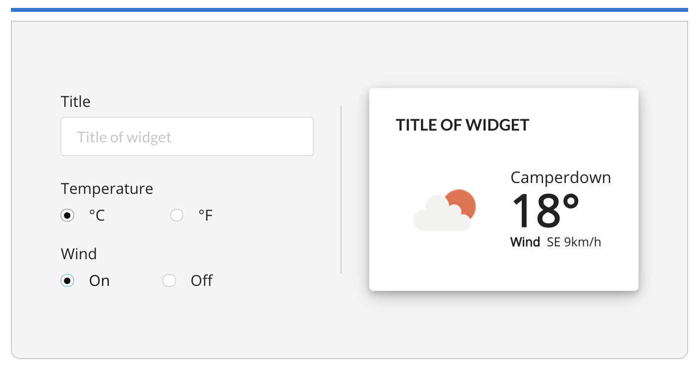

# Weather Widget Editor

### Description
A simple weather widget with a form to change what information the widget displays.

### How to run the app on your mac

- Download npm package manager
- clone the code from this repository
- type "npm install" to update the package manager
- type "npm start" to start the project on your local machine

### App Features

- Ability to edit the title of the widget
- Ability to change between degrees celsius and Fahrenheit
- Ability to hide or show wind conditions
- displays an icon representing the current weather conditions

### Future Improvements

- Refactor the fetchWeatherConditions method in the WidgetEditor component
- Refactor Form component so that it's broken up into smaller components
- Use Bootstrap instead of Semantic UI for a better design

### Technologies Used

- React 
- Semantic UI
- axios
- OpenWeatherMap API

### Author

Graham Herdman
